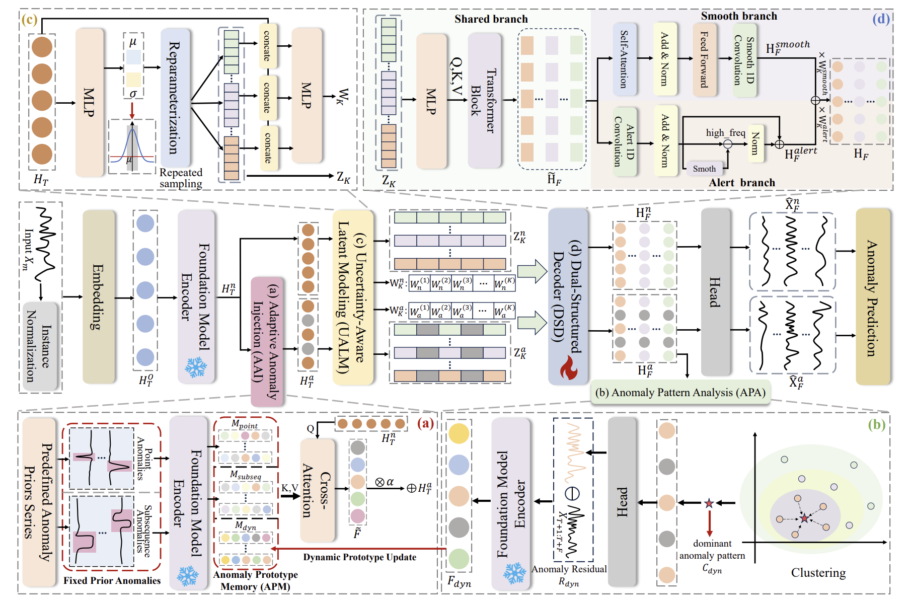
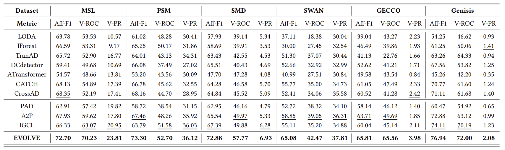

# EVOLVE: Multivariate Time Series Anomaly Prediction with Uncertainty-Aware, Adaptive Prototype Memories

## Introduction
Unsupervised time series anomaly prediction (AP) aims to forecast potential anomalies, providing early-warning signals for proactive intervention and predictive maintenance in complex systems. Most existing AP methods follow a perturbation-based paradigm, which simulates anomaly perturbations on historical time series to model abnormal future evolution in the absence of labeled anomalies. However, current approaches still suffer from two fundamental limitations. First, anomaly perturbations are static or random and do not consider the specific characteristics of each time series, failing to adapt to the heterogeneous sensitivity of different time series. Second, existing methods rely on deterministic historical representations and assume that the future time series follows a single fixed evolution path, overlooking the inherent uncertainty in future dynamics. To address these challenges, we propose $\textbf{EVOLVE}$, a novel time series anomaly prediction method that considers variable-wise anomaly perturbations and uncertainty-aware future evolution. Our method learns adaptive, variable-wise anomaly patterns to capture diverse anomaly structures for heterogeneous time series, while simultaneously modeling multiple plausible future paths for uncerta-inty-aware anomaly prediction. Extensive experiments on six benchmark datasets demonstrate that our method consistently outperforms state-of-the-art baselines.


<div style="text-align: center;">
    
</div>

## Quickstart

### Installation
Create and activate the Conda environment:

   ```bash
   conda create -n Evolve python=3.8 -y
   conda activate Evolve
   ```
Install dependencies:
   ```bash
   pip install -r requirements.txt
   ```

## Data preparation
The pre-processed MSL and GECCO datasets are already included in the `./dataset` folder.

## Train and evaluate model
- To see the model structure of Evolve, [click here](./ts_benchmark/baselines/Evolve/models/Evolve_model.py).

- For example you can reproduce a experiment result as the following:

```bash
bash ./scripts/multivariate/label/Evolve.sh
```

## Results
We systematically evaluated our method on six public multivariate datasets with a fixed 96-step look-back window. Results are averaged across four prediction horizons (32, 64, 128, 192) and three independent runs to ensure reliability:

<div style="text-align: center;">
    
</div>
